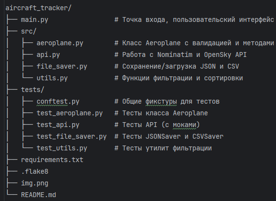

# Aircraft Tracker
Приложение для отслеживания самолётов в реальном времени через OpenSky Network API. Получает данные о воздушных судах в заданной стране, сохраняет их в JSON/CSV и предоставляет удобные инструменты для фильтрации и анализа.

## Возможности
* Получение списка самолётов в выбранной стране через OpenSky API
* Автоматическое определение границ страны (bounding box) через Nominatim (OpenStreetMap)
* Сохранение данных в JSON или CSV без дубликатов
* Фильтрация самолётов по:
* Стране регистрации
* Диапазону высот
* Вывод топ-N самолётов по высоте
* Сортировка по скорости
* Консольный интерактивный режим

## Требования
Python 3.9+

Установленный менеджер пакетов pip
## Установка

1) Клонируйте репозиторий:

```
git clone <repository-url>
cd aircraft_tracker
```
2) Создайте и активируйте виртуальное окружение:

```
python -m venv .venv
```
### Windows
.venv\Scripts\activate
### Linux/macOS
source .venv/bin/activate
Установите зависимости:

```
pip install -r requirements.txt
```
## Использование
Запуск интерактивного режима
```
python main.py
```
Далее следуйте инструкциям:

Введите название страны (например, Russia, United States)

Программа получит данные о самолётах и сохранит их в aeroplanes.json

Выберите действие из меню:

1) Показать топ N самолётов по высоте
2) Фильтровать по стране регистрации

3) Фильтровать по диапазону высот

4) Выйти
### Пример работы

=== Сбор данных о самолётах ===
Введите название страны: Russia
Bounding box для Russia: (41.185, 82.058, 19.638, 180.0)
Получено 42 самолётов.
Данные сохранены в aeroplanes.json

Выберите действие:
1. Показать топ N самолётов по высоте
2. Фильтровать по стране регистрации
3. Фильтровать по диапазону высот
4. Выйти
Ваш выбор: 1
Введите N: 2

Топ 5 по высоте:
1. AFL123 (Russia) - высота 11250 м, скорость 245 м/с
2. SBI789 (Russia) - высота 9800 м, скорость 210 м/с
...
## Структура проекта


## Тестирование
Проект покрыт тестами (покрытие ~95%). Для запуска тестов:

```
pytest tests/ -v --cov=src --cov-report=term-missing
``` 
Запуск отдельных тестов
```
pytest tests/test_aeroplane.py -v
```

```
pytest tests/test_utils.py::test_filter_by_country -v
```

## Примечания
Для работы API необходимо интернет-соединение

OpenSky API имеет ограничения на частоту запросов (для анонимных пользователей)

Bounding box страны определяется через Nominatim, что может быть неточным для некоторых стран

Все данные о самолётах сохраняются локально в формате JSON (по умолчанию aeroplanes.json) или CSV

## Лицензия
MIT

